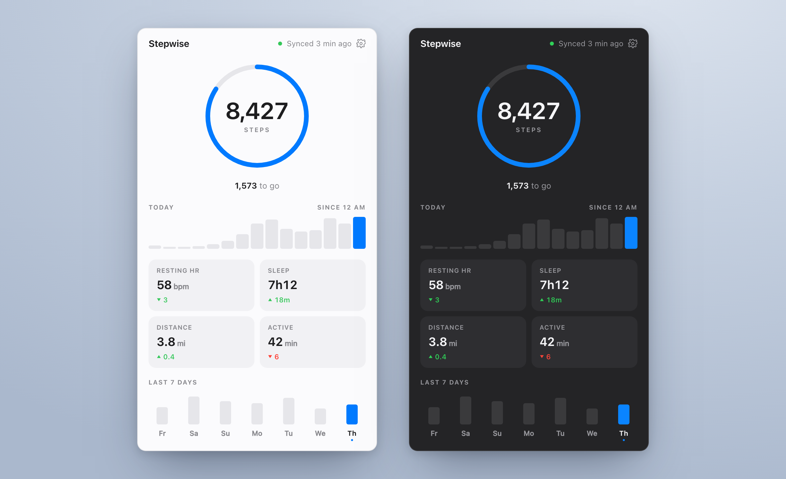
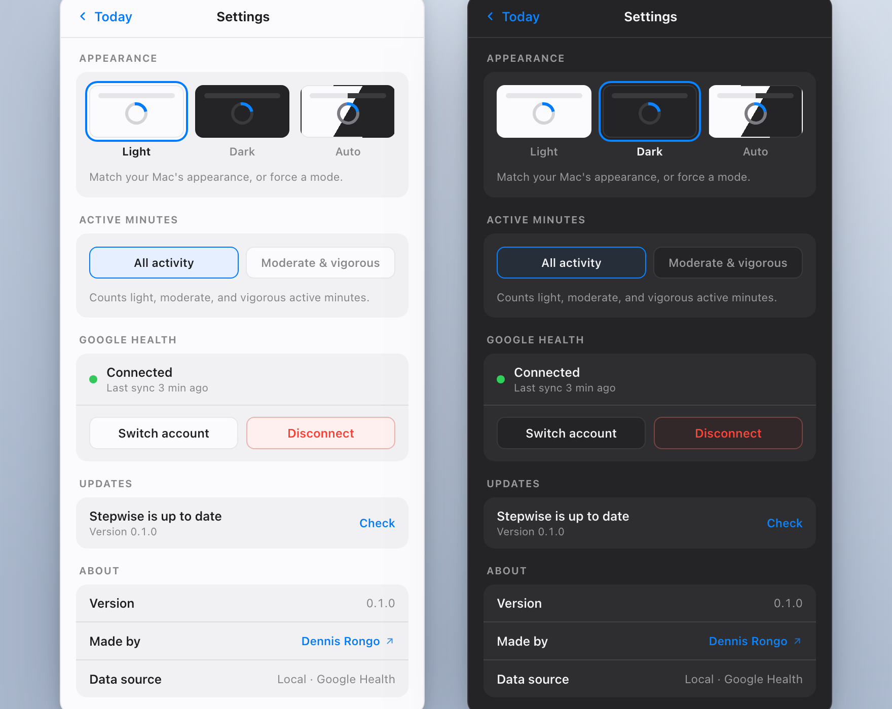

<h1 align="center">Stepwise</h1>

<p align="center">
  A calm, glanceable macOS menu-bar health dashboard.<br />
  Today's steps, the shape of your day, and the last week — read from your Pixel via Google Health.
</p>

<p align="center">
  
</p>

> **Honest about freshness.** The numbers reflect your phone's *last cloud sync*, not a live
> pedometer — so the header says "Synced 3 min ago" and never fakes a ticking counter. That
> mirrors the Google Health API itself: a daily / intraday roll-up of what the device has uploaded.

---

## What it does

- **Step ring** — today's count against a 10,000-step goal, with "1,573 to go".
- **Shape of the day** — slim hourly bars from midnight to now; the current hour is highlighted.
- **Four metrics** — resting HR, sleep, distance, and active minutes, each with a tiny up/down trend vs. yesterday.
- **Last 7 days** — a mini bar strip; click any day to swap the hero + cards to that day.
- **Glance on hover** — hovering the menu-bar icon shows a compact preview; click for the full panel. Anchors under the macOS menu bar (top) or above the Windows taskbar (bottom).
- **Light & dark** — follows the system by default, or force a mode in Settings.
- **Active-minutes mode** — count all activity, or only moderate + vigorous.
- **Auto-updates** — signed in-app updates via the Tauri updater.

<p align="center">
  
</p>

## How the data flows

Stepwise reads from **Google Health** using the same activity data your Pixel syncs to the cloud.

- **OAuth** — a desktop **loopback + PKCE** flow (no browser-side secrets). You pick the Google account; the app exchanges the code locally.
- **Encrypted at rest** — the refresh token is stored **AES-256-GCM** encrypted with an Argon2id key bound to a machine id. No plaintext `.gh-tokens.json`.
- **Read-only scopes** — activity & fitness (steps, distance, active minutes), health metrics (resting HR), and sleep.
- **Demo mode** — `STEPWISE_DEMO=1` fills realistic placeholder data so you can run the UI with no Google account.

## Develop

Requires Node + Rust (Tauri 2 prerequisites). Then:

```bash
npm install
cp .env.example .env        # add GOOGLE_CLIENT_ID / GOOGLE_CLIENT_SECRET

# Preview with placeholder data — no Google needed:
STEPWISE_DEMO=1 npm run tauri dev

# Real data (after filling .env and connecting in-app):
npm run tauri dev
```

> Create an OAuth client of type **Desktop app** in Google Cloud Console, enable the **Google Health API**,
> and add yourself as a **Test user** — that lets you use the sensitive health scopes without full app
> verification (fine for personal use). See `.env.example`.

## Architecture

A thin React frontend over a rich Rust backend — all OAuth, HTTP, persistence, and OS work live in Rust.

| Layer | Where | Notes |
|---|---|---|
| **UI** | `src/` | React + TypeScript. Renders the panel states + Settings; calls Rust through typed hooks (no `invoke()` inline in components). |
| **OAuth** | `src-tauri/src/oauth/` | Loopback + PKCE desktop flow. |
| **Health** | `src-tauri/src/health/` | Daily roll-up + intraday interval calls, behind a provider with a real Google source and a demo source. |
| **Encryption** | `src-tauri/src/encryption/` | AES-256-GCM + Argon2id, machine-bound. |
| **Platform** | `src-tauri/src/platform/` | Per-OS machine-id; the only place with `cfg(target_os)`. |
| **Tray** | `src-tauri/src/tray.rs` | Tray icon → borderless, transparent, always-on-top panel; cross-platform anchoring. |
| **Core** | `commands/ · state/ · storage/ · settings/ · error/` | Standard modular Tauri layout. |

## Releasing

Releases are signed, notarized, and auto-updating. macOS leads (owns the version bump + GitHub release);
Windows follows into the same release. The full runbook is in **[`docs/RELEASE.md`](docs/RELEASE.md)**, and
two skills drive it end to end:

- **`/release-macos`** — bump → universal build → Developer ID sign → notarize → updater manifest → publish.
- **`/release-windows`** — build the NSIS `.exe`, sign the update payload with the *same* key, merge `windows-x86_64` into the Mac's `latest.json`.

First-time setup (see the runbook): generate an updater key (`npx tauri signer generate`), set `pubkey` +
a GitHub `endpoints` entry under `plugins.updater` in `tauri.conf.json`, enable `createUpdaterArtifacts`,
and put your Apple notarization creds + `TAURI_SIGNING_PRIVATE_KEY` in `.env`.

## Credits

Built by **[Dennis Rongo](https://dennisrongo.com)**.
